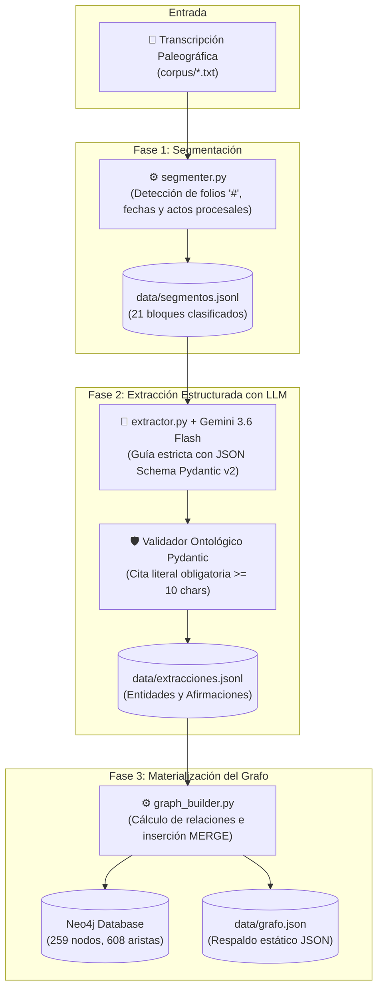
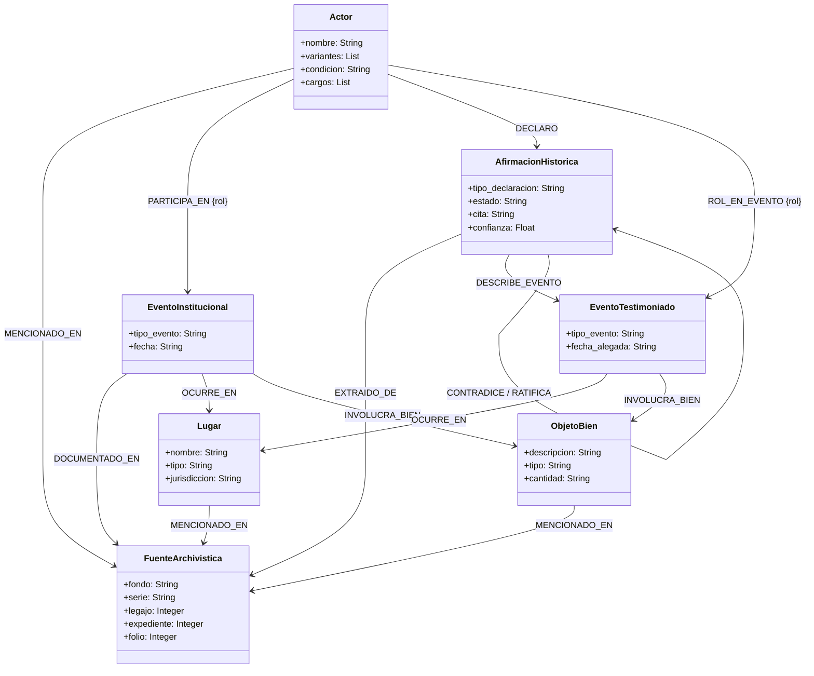
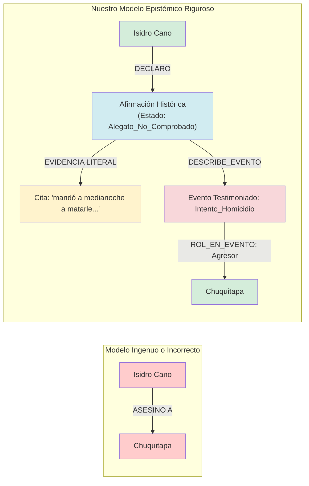

# Grafo de Conocimiento Histórico — Archivo Regional del Cusco (Fondo Intendencia)

[](https://www.python.org/)
[](https://docs.pydantic.dev/)
[](https://neo4j.com/)
[](https://aistudio.google.com/)
[](LICENSE)

Sistema automatizado de **construcción de grafos de conocimiento histórico** a partir de transcripciones paleográficas de procesos judiciales virreinales (siglos XVIII y XIX) del **Archivo Regional del Cusco (ARC)**, custodiados en el Fondo Intendencia (Causas Criminales).

Desarrollado como proyecto de investigación en la **Universidad Nacional de San Antonio Abad del Cusco (UNSAAC)**.

---

## 🏛️ Caso de Estudio Inicial: Expediente 18 (1806)

* **Fondo:** Intendencia
* **Serie:** Causas Criminales
* **Legajo:** 14 | **Expediente:** 18 (19 folios, 1806)
* **Asunto:** Querella criminal iniciada por **Manuel Huancachoque** (indio originario y soldado de milicias) contra el cacique-recaudador **Don Andrés Chuquitapa** y autoridades locales en el pueblo de Tinta, acusándolo de agresiones, pedreas y defraudación de tributos a las Reales Arcas.

---

## 🔬 Enfoque Metodológico y Ontológico

El proyecto implementa una arquitectura **Code-First Ontology**, formalizando el modelo conceptual directamente en código tipado ejecutable (**Pydantic v2**) para guiar y restringir la extracción estructurada mediante Modelos de Lenguaje Grande (LLMs).

### Estándares Internacionales Integrados
* **RiC-O (Records in Contexts - Ontology):** Modela la jerarquía archivística y trazabilidad documental (`Fondo`, `Serie`, `Legajo`, `Expediente`, `FuenteArchivistica / Folio`).
* **CIDOC CRM (ISO 21127):** Modela el patrimonio centrado en eventos (`E5_Event`, `E21_Person`, `E53_Place`, `E70_Thing`).
* **PROV-O (W3C Provenance Ontology):** Modela la procedencia y atribución de cada pieza testimonial (`wasAttributedTo`, `wasDerivedFrom`).
* **SKOS (Simple Knowledge Organization System):** Manejo de variantes ortográficas coloniales y nombres canónicos (`prefLabel`, `altLabel`).
* **OHAC (Ontología Histórica Andino-Colonial):** Vocabulario propio para llenar vacíos sociopolíticos del período virreinal tardío (*Ayllus, caciques principales, segundas, indios tributarios, forasteros, reservados*).

---

## 🔄 Flujo del Pipeline de Extracción

El pipeline automatizado se divide en 3 etapas desacopladas y reanudables:



---

## 📐 Esquema Ontológico del Grafo (Metamodelo)

Las clases y relaciones del grafo siguen el estándar ISO 21127 (CIDOC CRM) y RiC-O:



---

## ⚖️ Regla de Oro Epistémica: Modelado de Testimonios Judiciales

En un litigio criminal colonial, **una acusación o testimonio no es un hecho fáctico verificado**. Si se modelara directamente como hecho, el grafo registraría mentiras o calumnias como si hubieran ocurrido:



---

## 📁 Estructura del Repositorio

```text
GRAFO_CONOCIMIENTOS_CUSCO/
├── corpus/                 # Transcripciones paleográficas de entrada (.txt)
│   ├── Transcripcion_CC_L14E18.txt
│   └── corpus_modernizado.txt
├── ontology/               # Definición ontológica ejecutable
│   ├── __init__.py
│   ├── standards.py        # Mapeos conceptuales y URIs a estándares internacionales
│   └── models.py           # Modelos de dominio Pydantic v2 con validadores estrictos
├── pipeline/               # Módulos de procesamiento del pipeline
│   ├── __init__.py
│   ├── segmenter.py        # Segmentador heurístico de folios y actos procesales
│   ├── extractor.py        # Extractor LLM con JSON Schema, control de cuota y reanudación
│   └── graph_builder.py    # Constructor del grafo y conector Cypher (MERGE) para Neo4j
├── data/                   # Datos intermedios y respaldos exportados
│   ├── segmentos.jsonl     # Folios clasificados por el segmentador
│   ├── extracciones.jsonl  # Instancias validadas por el extractor LLM
│   └── grafo.json          # Respaldo estático del grafo (para Gephi, NetworkX, D3.js)
├── tests/                  # Suite de pruebas unitarias
│   ├── __init__.py
│   └── test_ontology.py    # Validación de reglas ontológicas con datos históricos reales
├── run.py                  # Orquestador del pipeline completo por línea de comandos
├── .env.example            # Plantilla de configuración de variables de entorno
├── requirements.txt        # Dependencias de Python
└── README.md               # Esta documentación
```

---

## 🚀 Requisitos Previos

1. **Python 3.11 o superior** (se recomienda usar [uv](https://github.com/astral-sh/uv) o `venv`).
2. **Neo4j:**
   * **Opción local:** [Neo4j Desktop](https://neo4j.com/download/) (gratuito) creando una instancia llamada `GrafoCusco`.
   * **Opción nube:** [Neo4j AuraDB Free](https://neo4j.com/cloud/aura/) (sin instalar nada).
3. **Clave de API de Gemini:** Gratuita en [Google AI Studio](https://aistudio.google.com/apikey) (solo requerida si vas a extraer nuevos documentos).

---

## 🛠️ Instalación y Configuración

### 1. Clonar el repositorio
```bash
git clone https://github.com/TU_USUARIO/TU_REPOSITORIO.git
cd GRAFO_CONOCIMIENTOS_CUSCO
```

### 2. Crear y activar el entorno virtual
* **En Windows (PowerShell):**
  ```powershell
  python -m venv .venv
  .venv\Scripts\activate
  ```
* **En Linux / macOS:**
  ```bash
  python3 -m venv .venv
  source .venv/bin/activate
  ```

### 3. Instalar dependencias
```bash
pip install -r requirements.txt
```

### 4. Configurar variables de entorno
Copia la plantilla `.env.example` a `.env`:
* **En Windows:** `copy .env.example .env`
* **En Linux/macOS:** `cp .env.example .env`

Edita el archivo `.env` con tus credenciales:
```env
GOOGLE_API_KEY=tu_clave_de_gemini_aqui
NEO4J_URI=bolt://localhost:7687
NEO4J_USER=neo4j
NEO4J_PASSWORD=tu_password_de_neo4j
```

---

## ⚡ Formas de Ejecución

El script `run.py` es el punto de entrada unificado para todas las operaciones:

### A. Cargar el grafo inmediatamente en Neo4j (Sin gastar API)
Si acabas de clonar el proyecto y quieres ver el grafo de inmediato en tu Neo4j local a partir de las extracciones ya validadas incluidas en el repositorio (toma ~3 segundos):
```bash
python run.py --solo-grafo
```

### B. Ejecutar el pipeline completo de extracción
Segmenta el texto, consulta a Gemini para estructurar entidades y carga todo en Neo4j:
```bash
python run.py
```

### C. Procesar un nuevo expediente del corpus
Para procesar cualquier otro archivo transcrito que añadas a `corpus/`:
```bash
python run.py --archivo corpus/NombreNuevoExpediente.txt
```

### D. Solo segmentar folios
Para revisar cómo el segmentador divide el texto en actos jurídicos sin hacer llamadas a internet:
```bash
python run.py --solo-segmentar
```

---

## 📊 Exploración y Visualización en Neo4j

Abre **Neo4j Desktop** (herramienta **Query**) o ingresa en tu navegador a **`http://localhost:7474`**.

### 1. Ver la red completa del litigio
```cypher
MATCH (n)
OPTIONAL MATCH (n)-[r]-(m)
RETURN n, r, m
```

### 2. Explorar el conflicto entre Huancachoque y el cacique Chuquitapa
```cypher
MATCH (a:Actor)-[r]-(ev)
WHERE a.nombre CONTAINS "Huancachoque" OR a.nombre CONTAINS "Chuquitapa"
RETURN a, r, ev
```

### 3. Consultar afirmaciones testimoniales con sus citas textuales literales
```cypher
MATCH (testigo:Actor)-[:DECLARO]->(af:AfirmacionHistorica)-[:DESCRIBE_EVENTO]->(ev)
RETURN testigo.nombre AS Testigo, 
       af.tipo_declaracion AS Tipo, 
       af.cita AS Cita_Literal, 
       ev.tipo_evento AS Evento
LIMIT 20
```

### 4. Ranking de actores con mayor centralidad en el expediente
```cypher
MATCH (a:Actor)-[r]-()
RETURN a.nombre AS Actor, a.tipo AS Tipo, count(r) AS Conexiones
ORDER BY Conexiones DESC
LIMIT 10
```

---

## 🧪 Pruebas Unitarias de Validación

El proyecto cuenta con una suite de pruebas que valida el cumplimiento de las restricciones ontológicas y la coherencia del esquema con datos del archivo:

```bash
pytest tests/ -v
```

---

## 📚 Referencias Científicas y Antecedentes

1. **Zbíral, D., Shaw, R., et al. (2021).** *Data collection in historical network research: An extreme proposal*. *Journal of Historical Network Research*, 5(1), 103–128. (Metodología de formalización de fuentes procesales judiciales y juicios inquisitoriales en Neo4j).
2. **Shaw, R., Zbíral, D., & Hampejs, T. (2026).** *Syntactic-semantic capture of historical texts as a platform for source-critical analysis*. *Digital Scholarship in the Humanities*, Oxford University Press.
3. **Doerr, M. (2003).** *The CIDOC CRM – an ontological approach to semantic categorization of cultural heritage information*. *Journal of Digital Information*, 4(1). (Estándar ISO 21127 para modelado histórico centrado en eventos).
4. **Llanes-Padrón, D., & Pastor-Sánchez, F. J. (2017).** *Records in Contexts: el nuevo estándar del Consejo Internacional de Archivos (ICA) y su ontología RiC-O*. *Revista Española de Documentación Científica*, 40(2).
5. **Zhang, L., et al. (2026).** *OntoEKG: An LLM-driven Pipeline for Strongly-Typed Knowledge Graph Construction*. *International Conference on Knowledge Engineering*.
6. **Düring, M., & Eumann, U. (2013).** *Historical Network Analysis: Its Promise, Problems, and Its History*. *Zeitschrift für Historische Forschung*, 39, 137–167.

---

## 👥 Autores y Contacto

* **Ian Quispe** — Universidad Nacional de San Antonio Abad del Cusco (UNSAAC).
* **Jhon** — Universidad Nacional de San Antonio Abad del Cusco (UNSAAC).

Proyecto desarrollado con fines de investigación académica en Historia Digital, Lingüística Computacional y Humanidades Digitales Andinas.
